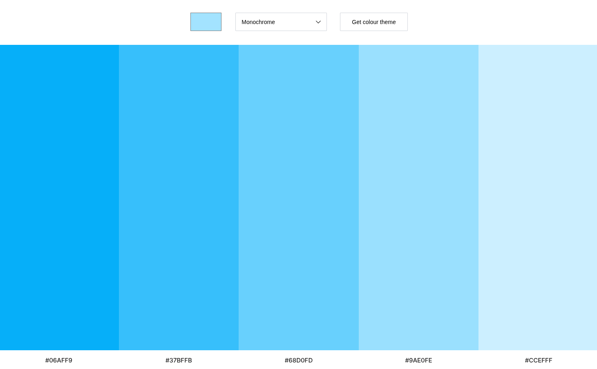

## Colour Scheme Generator

Colour Scheme Generator can generate colour schemes using The Color API.

This project was created with HTML5, CSS3, JavaScript and uses RESTful APIs to fetch a colour scheme from [The Color API]("https://www.thecolorapi.com")

### Features

- Select a seed colour
- Select a scheme mode
- Press the "Get colour theme" button to generate a colour scheme based on the seed colour and scheme mode selected

### Image

### Note

This project was created as a solo project assigned by Scrimba on the frontend developer course API module
